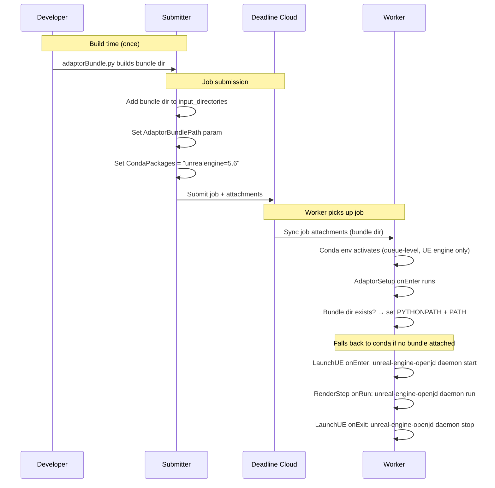

# Adaptor as Job Attachments

## Executive Summary

The UE adaptor is currently deployed to workers via the `unrealengine-openjd` conda package, requiring a full conda build/publish/deploy cycle for every adaptor change. This design replaces that with a job attachment approach: `adaptorBundle.py` packages the adaptor source and runtime dependencies into a directory that is uploaded with each job submission.

On the worker, a new `AdaptorSetup` job environment configures `PYTHONPATH` and `PATH` to use the attached bundle. The bundle always takes priority over conda because the `unrealengine-openjd` conda package will no longer be kept up to date. Conda is retained only as a backwards-compatibility fallback for jobs submitted by older submitters that do not attach a bundle. The `unrealengine` conda package (UE engine binaries) is unaffected.

Both old-submitter/new-worker and new-submitter/old-worker scenarios are backwards compatible. Estimated attachment size increase: ~20-30MB (deduplicated across jobs by Deadline Cloud). No cross-team dependencies.

---

# PART 1 — UNDERSTAND THE PROBLEM

## 1. Problem Description

### 1.1 Problem

The UE adaptor (`unreal_adaptor`, `unreal_perforce_utils`, and supporting modules) is currently deployed to worker nodes via conda packages (`unrealengine-openjd`). This requires building, publishing, and deploying a conda package for every adaptor change — a process that creates a high barrier to entry for contributors. Community members who want to fix bugs or add features must navigate the full conda packaging and deployment pipeline just to test a one-line change. This discourages community contribution and slows internal developer iteration and automated testing alike.

Stakeholders: UE integration developers, QA/test automation, DevOps.

### 1.2 Background

The current worker-side architecture works as follows:

```
  Job Submission                          Worker Node
 ┌──────────────────┐                   ┌──────────────────────────┐
 │ OpenJD templates  │                   │ Conda env (pre-installed)│
 │ reference command │──── job ────────► │  unrealengine-openjd pkg │
 │ unreal-engine-    │                   │  ├─ unreal_adaptor       │
 │ openjd            │                   │  ├─ unreal_perforce_utils│
 │                   │                   │  ├─ unreal_logger        │
 │ CondaPackages:    │                   │  ├─ unreal_cmd_utils     │
 │  unrealengine=5.6 │                   │  └─ openjd-adaptor-      │
 │  unrealengine-    │                   │     runtime + deps       │
 │  openjd=0.6.*     │                   └──────────────────────────┘
 └──────────────────┘
```

OpenJD templates invoke `unreal-engine-openjd` (a console_scripts entry point) and `unreal-engine-p4-utils` as commands. These commands are only available after the conda package is installed on the worker. The conda package bundles:

- `deadline.unreal_adaptor` — adaptor server + client + step handlers + schemas
- `deadline.unreal_perforce_utils` — P4 workspace management
- `deadline.unreal_logger` — logging bridge
- `deadline.unreal_cmd_utils` — CLI arg merging
- Runtime dependencies: `openjd-adaptor-runtime`, `deadline` client lib, `jsonschema`, `psutil`, `p4python`, `boto3`

There is already a `scripts/create_adaptor_packaging_artifact.sh` that bundles the adaptor into a tar.gz and a `depsBundle.py` that bundles submitter dependencies into a zip — both demonstrate the pattern of packaging Python code with dependencies for distribution.

The Deadline Cloud worker agent is pre-installed on workers and provides a Python environment with: `deadline` (client lib), `boto3`, `psutil`, `pywin32`, `openjd-model`, `openjd-sessions`, `requests`, and `pydantic`. This means the bundle only needs to carry dependencies NOT already in the worker agent environment — primarily `openjd-adaptor-runtime`, `jsonschema`, `pyyaml`, and `p4python`.

### 1.3 References

- `pyproject.toml` — package definition, entry points, dependencies
- `scripts/create_adaptor_packaging_artifact.sh` — existing adaptor packaging script
- `depsBundle.py` / `depsBundle.sh` — existing submitter dependency bundling
- OpenJD templates in `src/unreal_plugin/Content/Python/openjd_templates/`
- `openjd-adaptor-runtime` framework documentation

## 2. Solution Requirements

### 2.1 User Stories

- As a developer, I want to test adaptor changes on a worker by simply submitting a job, without building and deploying a conda package.
- As a community contributor, I want to make adaptor changes and test them without needing access to conda packaging infrastructure.
- As a CI system, I want to run integration tests against adaptor changes without a conda publish step.

### 2.2 Technical Requirements

1. WHEN a job is submitted, THE submitter SHALL bundle the adaptor source code and its runtime dependencies as job attachments that are uploaded alongside the job.
2. WHEN a job runs on a worker, THE OpenJD templates SHALL invoke the adaptor using `python -m` (or a wrapper script) from the attached files, NOT via a conda-installed `unreal-engine-openjd` entry point.
3. THE bundled adaptor attachment SHALL include: `unreal_adaptor`, `unreal_perforce_utils`, `unreal_logger`, `unreal_cmd_utils`, and only the third-party runtime dependencies NOT already provided by the worker agent. The worker agent provides `deadline` (client lib), `boto3`, `psutil`, `pywin32`, `openjd-model`, and `openjd-sessions`. The bundle MUST include: `openjd-adaptor-runtime` (includes `adaptor_runtime_client`), `jsonschema` (+ transitive deps: `attrs`, `referencing`, `jsonschema-specifications`, `rpds-py`), `pyyaml`, and `p4python`.
4. THE solution SHALL NOT require conda to be installed or configured on the worker node.
5. THE solution SHALL work with the existing Python interpreter available on the worker (Python ≥ 3.9).
6. THE adaptor bundle SHALL be the default mechanism for running the adaptor on the worker. If the bundle is attached, it SHALL always be used regardless of whether the conda adaptor is also available. If no bundle is attached, the conda-installed adaptor (`unrealengine-openjd`) SHALL be used as a fallback. If neither the bundle nor the conda adaptor is available, the job SHALL fail with a clear error message. If the bundle directory is not found at submission time, the submitter SHALL fail with a fatal error to prevent submitting jobs without an adaptor.
7. WHEN the adaptor scripts are attached to a job, THE worker SHALL be able to resolve all imports from the attachment directory without any pre-installed packages beyond the standard library and the worker agent's own environment.
8. THE `unreal-engine-p4-utils` CLI entry point SHALL also be converted to run from the attachment bundle.
9. THE OpenJD templates SHALL continue to use `unreal-engine-openjd` and `unreal-engine-p4-utils` as commands. The adaptor setup environment SHALL make these commands available on PATH via wrapper scripts when running from the bundle.
10. THE submitter SHALL produce a self-contained bundle (zip or directory) that can be built from the source tree without requiring conda tooling.
11. THE adaptor bundle setup (extraction, PYTHONPATH configuration) SHALL occur exactly once per session, in the job environment's `onEnter` action. Subsequent steps and tasks within the same session SHALL reuse the already-configured environment without re-extracting or re-configuring.

## 3. Out of Scope

- Changing the adaptor's internal architecture (Adaptor/Client split, step handlers, IPC).
- Modifying the submitter-side dependency bundle (`depsBundle.py`) — that is a separate concern for the UE Editor plugin.
- Supporting Linux workers (currently Windows-only; `p4python` and `WinClientInterface` are Windows-specific).
- Versioning or caching of the attachment bundle across jobs.

## 4. Assumptions

- Python ≥ 3.9 is available on the worker (provided by the Deadline Cloud worker agent or the system).
- The worker agent's own Python environment includes basic packages but NOT the adaptor-specific dependencies.
- Job attachments are downloaded to a known directory on the worker before OpenJD actions execute.
- `pip` is available at build/bundle time on the developer's machine for downloading dependencies.
- Job attachment size will increase by ~20-30MB (dominated by `p4python` ~15MB native wheel). This is an expected trade-off for eliminating the conda packaging dependency.
- The `unrealengine` conda package (which provides the Unreal Engine binaries) is unaffected by this change. Only the `unrealengine-openjd` conda package (which provides the adaptor) is being replaced.

## 5. Open Questions and Risks

1. **PYTHONPATH isolation**: Accepted as a risk for MVP. The worker agent currently does not ship `openjd-adaptor-runtime`, `jsonschema`, or `pyyaml`, so conflicts are unlikely. Revisit after MVP if agent dependencies change.
2. **OpenJD file references**: OpenJD templates can reference attached files via `{{Session.WorkingDirectory}}` or similar. Need to confirm the exact mechanism for referencing files from job attachments within template actions.

---

# PART 2 — DESIGN THE SOLUTION

## 6. Glossary

| Term | Definition |
|------|-----------|
| Adaptor bundle | A self-contained directory (or zip) containing the UE adaptor source code (`unreal_adaptor`, `unreal_perforce_utils`, `unreal_logger`, `unreal_cmd_utils`) and its runtime dependencies not provided by the worker agent. Built by `adaptorBundle.py` and uploaded as a job attachment. |
| Adaptor setup environment | A new OpenJD environment template whose `onEnter` action extracts the adaptor bundle and configures `PYTHONPATH`, exactly once per session. Replaces the `unrealengine-openjd` conda package — NOT the `unrealengine` conda package which still provides the UE engine itself. |
| `adaptorBundle.py` | Build script that assembles the adaptor bundle from source and downloads platform-specific wheels for dependencies. Analogous to the existing `depsBundle.py` for submitter dependencies. |
| Worker agent environment | The Python environment provided by the Deadline Cloud worker agent, which includes `deadline`, `boto3`, `psutil`, `pywin32`, `openjd-model`, `openjd-sessions`, and other packages. The adaptor bundle only carries deps NOT in this environment. |
| Adaptor conda package | The existing `unrealengine-openjd` conda package that this design replaces. The `unrealengine` conda package (which provides the Unreal Engine binaries) is unaffected by this change. |

## 7. Solution

### 7.1 System Architecture Diagram

```
  Job Submission (new default)              Worker Node
 ┌───────────────────────────┐            ┌─────────────────────────────────────┐
 │ Submitter                  │            │  Conda env (unrealengine=5.6 only)  │
 │                            │            │                                     │
 │ CondaPackages:             │            │  Job Attachments (synced to worker) │
 │  unrealengine=5.6          │──── job ──►│   └─ adaptor_bundle/               │
 │                            │            │       ├─ deadline/                  │
 │ Param.AdaptorBundlePath:   │            │       ├─ openjd/                   │
 │  <path-mapped by DC>       │            │       ├─ jsonschema, pyyaml, p4... │
 │                            │            │       └─ bin/                       │
 │ Job Attachments:           │            │          ├─ unreal-engine-openjd.cmd│
 │  adaptor_bundle/ (dir)     │            │          └─ unreal-engine-p4-utils.cmd
 │                            │            │                                     │
 │ Templates: unchanged       │            │  Adaptor Setup Env onEnter:         │
 │  command: unreal-engine-   │            │   1. bundle dir exists? → setup     │
 │  openjd                    │            │   2. adaptor on PATH? → use conda   │
 │                            │            │   3. neither? → fail with error     │
 └───────────────────────────┘            └─────────────────────────────────────┘
```

**Environment ordering**: The conda environment is a queue-level setting and always activates before job-level environments. The adaptor setup environment is job-level and prioritizes the attached bundle. If no bundle is present, it falls back to the conda-installed adaptor.

**Why bundle takes priority over conda**: The `unrealengine-openjd` conda package will no longer be kept up to date — maintaining it requires a full conda build/publish/deploy cycle that adds significant deployment overhead and delays. Users who still have `unrealengine-openjd` in their `CondaPackages` parameter may get a stale conda adaptor installed on the worker; the bundle must take priority to ensure the job always runs with the adaptor version matching the submitter. Conda is retained only as a backwards-compatibility fallback for jobs submitted by older submitters that do not attach a bundle.

**No `onExit` cleanup needed**: Each job session starts with a clean environment. The `PYTHONPATH` and `PATH` modifications from the adaptor setup environment do not persist across sessions.

### 7.2 Components

Four components are modified or created:

#### 7.2.1 `adaptorBundle.py` (new file)

Build script that assembles the adaptor bundle directory. Analogous to the existing `depsBundle.py`.

**Responsibilities:**
- Copy adaptor source modules (`unreal_adaptor`, `unreal_perforce_utils`, `unreal_logger`, `unreal_cmd_utils`) into the bundle directory
- Download platform-specific wheels for dependencies not in the worker agent (`openjd-adaptor-runtime`, `jsonschema` + transitive deps, `pyyaml`, `p4python`) using `pip install --target`
- Generate wrapper `.cmd` scripts in `bin/`:
  - `unreal-engine-openjd.cmd`: `@echo off\npython -m deadline.unreal_adaptor.UnrealAdaptor %*`
  - `unreal-engine-p4-utils.cmd`: `@echo off\npython -m deadline.unreal_perforce_utils.cli %*`
- Remove submitter code from the bundle (only adaptor code ships)
- Target: `win_amd64`, Python 3.11

#### 7.2.2 `adaptor_setup_environment.yml` (new template)

New OpenJD environment template added as a job-level environment.

```yaml
name: AdaptorSetup
script:
  embeddedFiles:
  - name: setupScript
    filename: adaptor-setup.cmd
    type: TEXT
    data: |
      @echo off
      set "BUNDLE_PATH={{Param.AdaptorBundlePath}}"
      if exist "%BUNDLE_PATH%" (
        echo Using adaptor from job attachment bundle: %BUNDLE_PATH%
        echo openjd_env: PYTHONPATH=%BUNDLE_PATH%
        echo openjd_env: PATH=%BUNDLE_PATH%\bin;%PATH%
        exit /b 0
      )
      where unreal-engine-openjd >nul 2>&1
      if %ERRORLEVEL% == 0 (
        echo Adaptor found on PATH via conda, using as fallback
        exit /b 0
      )
      echo ERROR: No adaptor available. Attach the adaptor bundle or add unrealengine-openjd to CondaPackages. 1>&2
      exit /b 1
  actions:
    onEnter:
      command: '{{Env.File.setupScript}}'
      cancelation:
        mode: NOTIFY_THEN_TERMINATE
```

**No `onExit` action** — environment variables are session-scoped and do not persist across jobs.

#### 7.2.3 Submitter changes (`unreal_open_job.py`)

- **`get_asset_references()`**: Add the adaptor bundle directory to `input_directories`
- **Job template parameter definitions**: Add `AdaptorBundlePath` parameter (`type: PATH`, `dataFlow: IN`, `control: HIDDEN`)
- **`_build_parameter_values()`**: Set `AdaptorBundlePath` value to the local path of the built bundle. If the bundle directory is not found, submission fails with a `FileNotFoundError` — this is a fatal error to prevent jobs from being submitted without an adaptor.
- **Job environments list**: Insert `AdaptorSetup` environment before the `LaunchUnrealEditor` environment

#### 7.2.4 Job template changes (`render_job.yml`, `p4_render_job.yml`)

- Change `CondaPackages` default from `unrealengine=5.6 unrealengine-openjd=0.6.*` to `unrealengine=5.6`
- Add `AdaptorBundlePath` parameter definition:
  ```yaml
  - name: AdaptorBundlePath
    type: PATH
    objectType: DIRECTORY
    dataFlow: IN
    userInterface:
      control: HIDDEN
  ```

**Unchanged templates**: All step and environment templates that use `command: unreal-engine-openjd` or `command: unreal-engine-p4-utils` remain unchanged — the wrapper `.cmd` scripts in `bin/` make these commands resolve from the bundle.

### 7.3 Dependencies

| Dependency | Direction | What happens if it fails? |
|-----------|-----------|--------------------------|
| Deadline Cloud job attachments (S3 sync) | Upstream | Bundle files not downloaded to worker. `onEnter` fails with "bundle dir not found" error. Job fails before adaptor starts. |
| Worker agent Python environment | Upstream | If worker agent packages (`deadline`, `boto3`, etc.) are missing or wrong version, adaptor imports fail at runtime. Same risk as today with conda. |
| `pip` on build machine | Build-time | `adaptorBundle.py` can't download wheels. Developer gets clear build error. No impact on workers. |
| Conda environment (queue-level) | Upstream | If conda fails to activate, UE engine binaries aren't available. Existing behavior, unrelated to this change. |
| `openjd-adaptor-runtime` version compatibility | Runtime | If bundled version is incompatible with worker agent's `openjd-sessions`, adaptor crashes at startup. Mitigated by pinning compatible versions in `adaptorBundle.py`. |

### 7.4 Sequence Diagrams



### 7.5 Data Models

No new data models. The adaptor bundle is a plain directory of Python files and wheels. The only new data flowing through the system is the `AdaptorBundlePath` job parameter (type: PATH).

### 7.6 Backwards Compatibility

- **Not a breaking change.** Both old-submitter/new-worker and new-submitter/old-worker scenarios are compatible.
- **Old submitter + new worker**: Old submitter includes `unrealengine-openjd` in `CondaPackages` and does not attach a bundle. Adaptor setup env finds no bundle, detects conda adaptor on PATH, and uses it as fallback.
- **New submitter + old worker**: New submitter attaches bundle and embeds `AdaptorSetup` environment in the job template. The worker executes the template — bundle is synced via job attachments, `onEnter` sets up paths. No worker-side changes needed.
- **Migration**: Users updating the submitter get the new behavior automatically. No manual steps required.

### 7.7 Additional Considerations

- **Scaling**: Bundle is ~20-30MB per job. Deadline Cloud's content-addressed storage deduplicates — unchanged files aren't re-uploaded. Subsequent jobs with the same adaptor version have near-zero upload overhead.
- **Failure/recovery**: If `onEnter` fails, the job fails cleanly before any UE work starts. No partial state to clean up.
- **Future evolution**: Adding Linux support means adding `.sh` wrapper scripts alongside `.cmd` files and downloading linux wheels in `adaptorBundle.py`. The architecture doesn't change.

## 8. Solutions Considered and Discarded

1. **`python -m` directly in templates** — Change all templates from `command: unreal-engine-openjd` to `command: python` with `-m` args. Discarded because it breaks backwards compatibility with conda fallback and requires modifying every step/environment template.

2. **Runtime-generated wrapper scripts** — Have `onEnter` dynamically create `.cmd` wrappers in a temp directory. Discarded in favor of pre-built wrappers in the bundle — simpler, inspectable, no temp dir management.

3. **Zip archive bundle** — Attach bundle as a `.zip`, extract in `onEnter`. Discarded because Deadline Cloud's content-addressed storage already deduplicates files across jobs. A pre-extracted directory avoids extraction time and benefits from incremental sync (only changed files re-upload).

4. **Scan for bundle at runtime** — Have `onEnter` search known directories for the bundle instead of using a PATH parameter. Discarded because it depends on internal knowledge of how the worker agent lays out downloaded files. Using a `PATH`-typed parameter lets Deadline Cloud handle path mapping.

## 9. Security Considerations

### 9.1 Threat Model

- **Tampered bundle**: The adaptor bundle is customer-submitted content, same as project files and scripts already attached to jobs. Per the shared responsibility model, customer-submitted content is untrusted and runs in an isolated worker environment. No change in risk compared to the current workflow.
- **PYTHONPATH injection**: The bundle directory is prepended to PYTHONPATH, which could shadow worker agent modules. Mitigated by only bundling deps NOT in the worker agent. Accepted as a deferred risk (see Open Questions).
- **No new attack surface**: The bundle runs with the same permissions as the existing conda-installed adaptor. No new network access, no new credentials, no privilege escalation.

### 9.2 Data Inventory

No new data stored or transmitted beyond what already exists. The adaptor bundle contains only open-source Python packages and the adaptor source code (already in the repo). No secrets, credentials, or customer data in the bundle.

## 10. Work Required

### 10.1 Effort Estimates

| Work Item | Size | Notes |
|-----------|------|-------|
| `adaptorBundle.py` build script | S | Follows existing `depsBundle.py` / `create_adaptor_packaging_artifact.sh` patterns |
| `adaptor_setup_environment.yml` template | S | Simple `.cmd` script with 3-way check |
| Submitter changes (asset refs, param, env) | M | Touches `unreal_open_job.py`, parameter values, environment ordering |
| Job template changes (CondaPackages default, new param) | S | `render_job.yml`, `p4_render_job.yml` |
| Unit tests | M | Bundle script, submitter changes, template validation |
| Integration test | M | End-to-end: submit job with bundle, verify adaptor runs on worker |
| Documentation / release notes | S | |

No cross-team dependencies. All work is within the UE integration repo.

### 10.2 Proposed Milestones

#### Milestone M1: Bundle Build + Setup Environment

**Acceptance criteria:** `adaptorBundle.py` produces a valid bundle directory, and `adaptor_setup_environment.yml` correctly sets up PYTHONPATH/PATH on a worker.

1. Create `adaptorBundle.py`
2. Create `adaptor_setup_environment.yml`
3. Unit tests for bundle script

#### Milestone M2: Submitter Integration

**Acceptance criteria:** Submitter attaches bundle, sets `AdaptorBundlePath` param, updates `CondaPackages` default. Job template includes `AdaptorSetup` environment.

1. Update `unreal_open_job.py` — asset references, parameter, environment
2. Update `render_job.yml` and `p4_render_job.yml` — CondaPackages default, new param
3. Unit tests for submitter changes

#### Milestone M3: End-to-End Validation

**Acceptance criteria:** Job submitted with new submitter runs successfully on worker using adaptor bundle. Conda fallback also works when `unrealengine-openjd` is added back to `CondaPackages`.

1. Integration test: bundle mode
2. Integration test: conda fallback mode
3. Release notes

M1 and M2 can be developed in parallel. M3 depends on both.

---

# PART 3 — IMPLEMENTATION PLAN (Agent-executable)

## Test Plan

Unit tests are automated via `hatch run test`. E2E tests are automated via `hatch run e2e` but require AWS Deadline Cloud authentication, a running worker, and a UE installation. Manual tests require human interaction with the UE Editor UI.

### Unit Tests by Component

| Test | Type | Validates |
|------|------|-----------|
| `test_adaptor_bundle_creates_directory` | Unit | Req 10 — bundle script produces valid directory structure |
| `test_adaptor_bundle_includes_all_modules` | Unit | Req 3 — all 4 adaptor modules present |
| `test_adaptor_bundle_includes_deps` | Unit | Req 3 — bundled deps present, worker agent deps excluded |
| `test_adaptor_bundle_generates_wrapper_scripts` | Unit | Req 9 — `.cmd` wrappers exist and have correct content |
| `test_submitter_adds_bundle_to_asset_references` | Unit | Req 1 — bundle dir in `input_directories` |
| `test_submitter_sets_adaptor_bundle_path_param` | Unit | Req 1 — `AdaptorBundlePath` param set |
| `test_submitter_conda_packages_default` | Unit | Req 6 — `CondaPackages` default is `unrealengine=5.6` only |
| `test_submitter_includes_adaptor_setup_env` | Unit | Req 11 — `AdaptorSetup` environment in job template |
| `test_setup_env_skips_when_conda_present` | Integration | Req 6 — conda adaptor on PATH, no bundle → conda used as fallback |
| `test_setup_env_activates_bundle` | Integration | Req 6, 11 — bundle attached → bundle always used, even if conda present |
| `test_setup_env_fails_when_neither` | Integration | Req 6 — no conda, no bundle → clear error |

### E2E & Manual Test Matrix

Prerequisites:
- Unreal Engine 5.7 installed with the Deadline Cloud plugin
- AWS Deadline Cloud farm with a queue and fleet (SMF or CMF)
- Worker node registered and running
- Deadline Cloud Monitor for job observation

| # | Test Case | Type | File | Expected Result |
|---|-----------|------|------|-----------------|
| **T1** | **Basic render with bundle** | E2E ✅ | `test_worker_agent.py` | Job succeeds on SMF or CMF. Logs show `"Using adaptor from job attachment bundle"`. |
| **T2** | **Bundle priority over conda** | E2E ✅ | `test_adaptor_bundle_priority.py` | Logs show bundle used, NOT conda fallback. |
| **T3** | **Conda fallback (old submitter)** | E2E ✅ | `test_adaptor_fallback_scenarios.py` | Logs show `"Adaptor found on PATH via conda, using as fallback"`. |
| **T4** | **No bundle, no conda → clear error** | E2E ✅ | `test_adaptor_fallback_scenarios.py` | Job fails with `"No adaptor available"` error. |
| **T5** | **Perforce job with bundle** | Manual | — | P4 sync and render complete. `unreal-engine-p4-utils` resolves from bundle. |
| **T6** | **Bundle env persists across steps** | E2E ✅ | `test_worker_agent.py` | AdaptorSetup onEnter runs exactly once per session. |
| **T7** | **CondaPackages default** | E2E ✅ | `test_worker_agent.py` | No `unrealengine-openjd` in CondaPackages. (Also unit test.) |
| **T8** | **Job bundle inspection** | E2E ✅ | `test_create_job.py` | `AdaptorSetup` env present. `AdaptorBundlePath` valid. No `unrealengine-openjd`. `adaptor_bundle` in asset refs. |

### How to Check Worker Logs
1. Open Deadline Cloud Monitor → select the job → click on a session
2. Or use CloudWatch Logs: log group `/aws/deadline/{farmId}/{queueId}`, find the session log stream
3. Search for:
   - `"Using adaptor from job attachment bundle"` — bundle was used
   - `"Adaptor found on PATH via conda, using as fallback"` — conda fallback was used
   - `"No adaptor available"` — neither found (expected failure)

## Implementation Tasks

### M1: Bundle Build + Setup Environment (⚡ parallel with M2)

**Task 1** ⚡ — Create `adaptorBundle.py`
- Input: adaptor source in `src/deadline/`, `pyproject.toml` for dep versions
- Create bundle dir with: adaptor modules, deps via `pip install --target`, wrapper `.cmd` scripts in `bin/`
- Follow patterns from `create_adaptor_packaging_artifact.sh` and `depsBundle.py`
- Target: `win_amd64`, Python 3.11

**Task 2** ⚡ — Create `adaptor_setup_environment.yml`
- New file in `src/unreal_plugin/Content/Python/openjd_templates/`
- Embedded `.cmd` script: check bundle dir → check PATH → set env vars or fail
- No `onExit` needed

**Task 3** — Unit tests for Tasks 1-2
- Test bundle directory structure, module presence, dep presence, wrapper script content
- Depends on Tasks 1-2

### M2: Submitter Integration (⚡ parallel with M1)

**Task 4** ⚡ — Update job templates
- `render_job.yml`: change `CondaPackages` default to `unrealengine=5.6`, add `AdaptorBundlePath` param
- `p4_render_job.yml`: same changes
- Test templates in `Source/UnrealDeadlineCloudService/Private/Tests/openjd_templates/`: update accordingly

**Task 5** ⚡ — Update submitter `unreal_open_job.py`
- `get_asset_references()`: add bundle dir to `input_directories`
- `_build_parameter_values()`: set `AdaptorBundlePath` value
- `_build_template()`: insert `AdaptorSetup` environment before `LaunchUnrealEditor`

**Task 6** — Unit tests for Tasks 4-5
- Test asset references include bundle, param values, template structure
- Depends on Tasks 4-5

### M3: End-to-End Validation (depends on M1 + M2)

**Task 7** — E2E tests (`test/end_to_end/`)
- `test_worker_agent.py::test_create_job_with_worker_agent` — From single job: bundle used (T1), onEnter once (T6), CondaPackages default (T7) ✅ implemented
- `test_adaptor_bundle_priority.py` — Bundle priority over conda when both present (T2) ✅ implemented
- `test_adaptor_fallback_scenarios.py` — From single UE submission, resubmit modified bundles: conda fallback (T3), no adaptor error (T4) ✅ implemented

**Task 8** — Manual tests (require human / special infrastructure)
- T5: Perforce job with bundle

**Task 9** — Update canary tests on service side
- Update existing canary tests to reflect new default `CondaPackages` value and adaptor bundle attachment

**Task 10** — Release notes and documentation