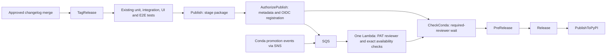

# Event-driven release workflow

`Release: Stage and Publish` keeps a release in one GitHub Actions run:



Changelog review and merging remain manual. Version bump automation is separate.
The existing test, build, signing, staging, and public publishing jobs are retained.
`TagRelease` validates the tag and supplies it and the Python version to publication
jobs. Release tags must remain fixed while a release is in progress.
The redundant `ValidateRelease` job is removed; no new jobs are added.

After staging, `AuthorizePublish` uploads the release metadata and sends its run
identity to SQS using GitHub OIDC. `CheckConda` waits on a required-reviewer
GitHub environment. No runner is occupied during the environment wait.

A single Lambda receives registrations and native Conda events. It uses a PAT
owned by the environment's required reviewer to report progress as commit statuses
linked to the workflow run, then approve or reject the pending environment through
GitHub's pending-deployments API. Progress appears in commit checks; this mechanism
does not provide the custom App's comments in the environment-wait panel.
The workflow has no scheduled readiness check, App, or webhook requirement.

## Infrastructure prerequisite

Configure the gate before merging this workflow replacement:

1. One SQS queue receives IAM-authorized release registrations and notifications
   from the configured Pipelines SNS topic; a DLQ isolates exhausted retries.
2. One Lambda reads that queue, the configured pipeline, and its PAT secret.
3. A GitHub OIDC registration role trusts only this repository's `mainline` ref
   and allows only `sqs:SendMessage` on the registration queue. Pull requests,
   forks, and other branches cannot assume it.
4. The PAT belongs to the environment's required reviewer and can read Actions,
   Contents, and Deployments, write Deployments, and write Commit statuses.
   GitHub must explicitly report `current_user_can_approve=true` before approval.
5. Lambda verifies successful registration in the current workflow attempt,
   the metadata artifact digest, repository, workflow, run, tag, package, and
   platforms. Final authorization requires the completed DocsUpdate approval
   workflow and the exact version/platforms in the public manifest.
6. Every approval retry repeats the final availability checks. A newer pipeline
   revision alone does not prove that the requested package is available.

No database, S3 registration record, scheduled poller, or reporting Lambda is used.
GitHub commit statuses identify registered run attempts; pipeline discovery state
is recomputed from authoritative APIs. Native events trigger reconciliation.

The Gamma infrastructure is configured manually. The existing production CDK CR
remains draft and unchanged; its App implementation must be adapted to this PAT
contract in the later production infrastructure review before cutover.

## Enable the workflow

1. Create `conda-gamma` for the Gamma gate, or `conda-release` for production.
2. Restrict deployment branches to `mainline`. Configure exactly one required
   user reviewer: the PAT owner. Leave wait timers and custom App rules disabled.
   If that account triggers releases, leave **Prevent self-review** unchecked.
   The gate still checks GitHub's actual approval eligibility on each request.
3. Store the authorized PAT as the `token` field in the Lambda's configured secret.
   Set its `PAT_REVIEWER_LOGIN` to that account's GitHub login. The PAT stays in AWS;
   it is never passed to the release workflow. Organization PAT policies apply.
4. Confirm the pipeline subscription and verify the PAT's permissions and reviewer
   configuration before enabling the SQS consumer. GitHub checks approval eligibility
   when the actual release reaches its wait.
5. Set repository variables:

   | Variable | Gamma value |
   | --- | --- |
   | `CONDA_RELEASE_ENVIRONMENT` | `conda-gamma` |
   | `CONDA_RELEASE_GAMMA_REGISTRATION_ROLE_ARN` | `arn:aws:iam::527561604569:role/kavmur-conda-gate-gamma-register` |
   | `CONDA_RELEASE_GAMMA_QUEUE_URL` | `https://sqs.us-west-2.amazonaws.com/527561604569/kavmur-conda-gate-gamma-events` |

   The environment defaults to `conda-release` when its variable is unset.
   `CONDA_RELEASE_APP_ID` is no longer used. Production registration variables
   `CONDA_RELEASE_REGISTRATION_ROLE_ARN` and `CONDA_RELEASE_QUEUE_URL` are configured
   after the production infrastructure is deployed; Gamma uses its own variables.
6. Review and merge this PR, then enable `EVENT_DRIVEN_CONDA_RELEASE_ENABLED=true`
   with `CONDA_RELEASE_ENVIRONMENT=conda-gamma`. Observe the next intended release. The real staging and public publication jobs remain
   enabled; no extra test harness or public test release is required.

Without release opt-in, the workflow skips before tagging or staging.
`AuthorizePublish` rejects missing registration configuration before entering the
wait. Required-reviewer protection must remain enabled: `CheckConda` relies on
that protection and does not duplicate Lambda's availability checks.

The replacement removes the old Stage workflow and scheduled Publish workflow.
Merging before the gate is configured blocks new releases; keep this PR draft
until its prerequisites are verified.

## Gamma-first rollout

1. Keep the production CDK CR unchanged while the manually configured Gamma gate
   handles the next intended release in this repository.
2. Use the actual workflow from this PR, including its existing tests, staging,
   signing, GitHub release, and PyPI jobs. No alternate test workflow is required.
3. That release verifies native SNS delivery, promotion progress, the PAT's actual
   approval eligibility, automatic resume, and public publication. These have not
   all been verified by the earlier App PoC or the read-only PAT probe. They are
   acceptance criteria for that first Gamma-backed release, not prerequisites for
   creating a separate test release.
4. If the release does not progress as expected, diagnose and fix the Gamma gate
   while the public publishing jobs remain behind `CheckConda`.
5. After a successful real release, adapt/review the draft CDK implementation for
   the PAT contract and deploy the production queue, Lambda, OIDC role, credential
   access, environment, and event subscription. The existing production CI-bot PAT
   can be reused after its identity and permissions are verified.
6. Set production `CONDA_RELEASE_REGISTRATION_ROLE_ARN` and `CONDA_RELEASE_QUEUE_URL`
   to the deployed resources while `CONDA_RELEASE_ENVIRONMENT` stays `conda-gamma`.
   Gamma continues using its separate queue and role throughout this preparation.
7. Let active Gamma releases finish. Change only `CONDA_RELEASE_ENVIRONMENT` to
   `conda-release` before the next release. This selects the production wait,
   registration queue, and OIDC role together; no workflow code change is needed.
   Switching the setting does not migrate an already running release.

## Registration contract

After staging, `AuthorizePublish` uploads `conda-release-metadata-<run_attempt>`
containing only `release.json`:

```json
{
  "schema_version": 1,
  "repository": "aws-deadline/deadline-cloud-for-unreal-engine",
  "run_id": 123,
  "run_attempt": 1,
  "tag": "1.2.3",
  "version": "1.2.3",
  "package_name": "unrealengine-openjd",
  "required_platforms": ["win-64"],
  "source_commit": "0123456789abcdef0123456789abcdef01234567"
}
```

The same job sends this IAM-authenticated message to SQS:

```json
{
  "kind": "register",
  "repository": "aws-deadline/deadline-cloud-for-unreal-engine",
  "run_id": 123,
  "run_attempt": 1
}
```

A 60-second delivery delay lets the registration job finish and the protected
wait appear; it is not a periodic Conda check. The artifact lasts 90 days,
outliving GitHub's maximum 30-day environment wait.

Progress statuses use context `conda-release:<run_id>:<run_attempt>` on the run's
head commit. Lambda accepts its configured PAT owner's statuses only. It writes
success before reviewing the environment; if the callback fails, it revalidates
DocsUpdate and public availability before retrying approval. Invalid release
metadata results in a failure status and rejection of that environment only.

## Recovery and limits

Use **Run workflow** on `mainline` with a validated existing tag to restage a release.
Use **Re-run all jobs** after cancellation, gate failure, or expiration so staging,
metadata, and registration are recreated for the new attempt. Re-running only
failed jobs can retain an older artifact; the gate rejects stale identity.

Later changelog merges do not cancel a waiting release. Each release has its own
concurrency group. Avoid dispatching duplicates of the same tag.

For rejection or missing availability, inspect the commit status, Lambda logs,
and event delivery before rerunning. No periodic reminders are sent when events
stop; GitHub's environment timeout is the final limit. Expired/revoked PATs and
organization access changes fail closed until credentials are restored.

Existing release approvals and signing/publication credentials remain unchanged.
The Lambda receives no signing or publishing credentials.

## Verification

Run `hatch run test -- test/unit/test_conda_release.py --no-cov` for metadata guards
and `actionlint` for workflow validation.

The earlier dev/fork PoC verified real builds, the protected wait, progress,
controlled App approval, and continuation. It does not prove the PAT approval path.
The manual Gamma PAT handler passed focused mocked tests for approval, exact
availability, reviewer eligibility, mismatched identity, and callback retries.
Live PAT approval and native event delivery are verified by the next intended
Gamma-backed release before production infrastructure rollout.
