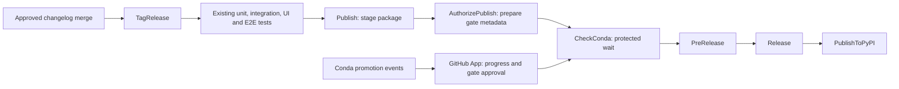

# Event-driven release workflow

`Release: Stage and Publish` keeps a release in one GitHub Actions run:



Changelog review and merging remain manual. Version bump automation is separate.
The workflow has no scheduled readiness check. While the App tracks Conda promotion,
GitHub displays a waiting environment job and an App check with promotion progress.
No runner is occupied during the environment wait.

The workflow reuses the existing Stage and Publish jobs and removes the redundant
`ValidateRelease` job. `TagRelease` validates the tag before tests and staging;
all publication jobs use that same tag and its Python-version output. Release tags
must remain fixed while the release is in progress.
`AuthorizePublish` records the release identity after staging succeeds.
`CheckConda` is a protected wait with a completion message after the App approves.
The App verifies final DocsUpdate completion and exact manifest availability.
Existing tests, builds, signing, and publishing steps are preserved.

## Infrastructure prerequisite

Deploy and verify the release protection App before merging this workflow replacement.
The App must:

1. Have access only to the intended release repositories, with Actions read, Checks
   write, Deployments write, and Contents read permissions.
2. Handle signed `deployment_protection_rule` webhooks and subscribe to Conda
   promotion and approval events.
3. Read the metadata artifact from the requesting workflow, validate the repository,
   workflow, run attempt, staged release, package, and platforms, and report progress
   on a check attached to the workflow's `head_sha`.
4. Approve after the final Conda approval workflow succeeds and the public manifest
   contains the exact package version on every required platform. A newer pipeline
   revision alone does not prove package availability.
5. Write the completed approval check before approving the environment. On a retry,
   reconcile the pending environment even if the check already records approval.
   Late registration must reconcile an already published package using the same
   availability criteria.

The infrastructure deployment and its event handling have their own review. The
personal fork PoC is evidence for the mechanism; it is not a production deployment.

## Enable the workflow

1. Install the release App on this repository.
2. Create environment `conda-release`. Enable the App's custom deployment protection
   rule and restrict deployment branches to `mainline`.
3. Set repository variable `CONDA_RELEASE_APP_ID` to the numeric production App ID.
4. Verify signed webhooks, the event subscription, exact package matching, progress,
   final approval, rejection, and retry handling in the development account and fork.
5. Set repository variable `EVENT_DRIVEN_CONDA_RELEASE_ENABLED` to `true`.
6. Merge the workflow change and observe the first approved changelog release.

Without `EVENT_DRIVEN_CONDA_RELEASE_ENABLED=true`, the workflow skips the release
chain before tagging or staging. `AuthorizePublish` rejects a missing or invalid
App ID before reaching the Conda gate. The App protection rule must remain enabled;
`CheckConda` relies on that rule for approval and does not duplicate Lambda's checks.


The replacement removes both the old Stage workflow and the scheduled Publish
workflow. Merging before the infrastructure is ready therefore blocks new releases.
Keep this change in draft until the infrastructure prerequisite is verified.

## App contract

After staging succeeds, the existing `AuthorizePublish` job uploads
`conda-release-metadata-<run_attempt>` containing only `release.json`:

```json
{
  "schema_version": 1,
  "repository": "aws-deadline/deadline-cloud-for-unreal-engine",
  "run_id": 123,
  "run_attempt": 1,
  "tag": "1.2.3",
  "version": "1.2.3",
  "package_name": "unrealengine-openjd",
  "required_platforms": ["win-64"],
  "source_commit": "0123456789abcdef0123456789abcdef01234567"
}
```

The artifact lasts 90 days, outliving GitHub's maximum 30-day environment wait.
The App's check has:

- `head_sha`: the requesting workflow run's head commit.
- `external_id`: `conda-release:<run_id>:<run_attempt>`.
- `status: completed`, `conclusion: success` when approval is ready.
- JSON `output.summary` with `approved: true` and `release` equal to the entire
  metadata object above. Additional progress fields may be included.

The App binds its Check and environment callback to the repository, release metadata,
and current run attempt. Checks also retain progress while the workflow is waiting.

## Recovery and limits

Use **Run workflow** on `mainline` with a validated existing tag to restage a release.
Use **Re-run all jobs** after cancellation, gate failure, or expiration so staging
and the metadata steps in `AuthorizePublish` are rerun for the new attempt.
Re-running only failed jobs can retain an older metadata artifact; that attempt is rejected before publishing.

Later changelog merges do not cancel a waiting release. Each distinct release has
its own concurrency group. GitHub can replace pending runs within the same group,
so avoid dispatching duplicate releases of the same tag.

On a gate rejection or manifest mismatch, public release jobs remain skipped and
the run fails. Diagnose the App's progress check and event delivery before rerunning.
An event-driven gate does not send periodic age reminders when no events arrive;
GitHub's environment timeout is the final limit.

The existing test projects, release environment approvals, signing, and PyPI
publishing mechanism are retained. The App does not receive signing or publishing
credentials.

## Verification

Run `hatch run test -- test/unit/test_conda_release.py --no-cov` for release metadata
validation, and validate the workflow with `actionlint`.

The earlier personal fork experiment exercised actual Unreal package builds,
the full nine-job Python/OS matrix, the environment wait, progress updates, automatic
approval from controlled development events, and post-gate artifact validation.
Native Conda event delivery still needs separate verification before rollout.
